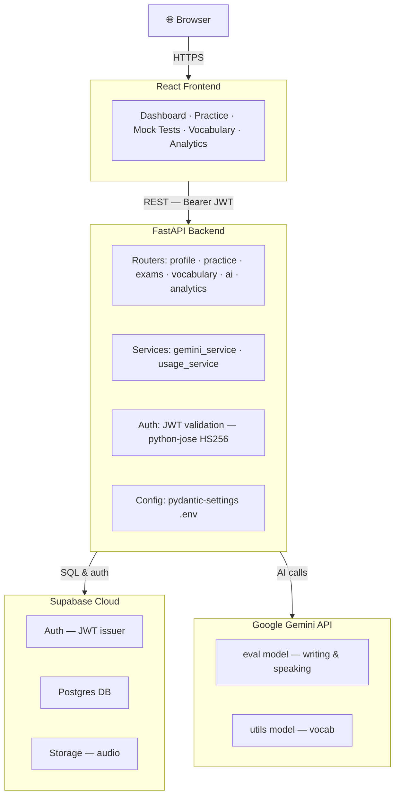

# Frensify

**Master your TEF & TCF exam with confidence.**

Frensify is a premium French exam preparation platform for students targeting Canadian immigration, university admission, or professional certification. Structured practice, full mock exams, and AI-powered writing and speaking feedback in one calm, exam-focused experience.

---

## Architecture




---

## Demo

[https://github.com/user-attachments/assets/5389c038-3bd6-438a-8eb5-c3d0460af879](https://github.com/user-attachments/assets/5389c038-3bd6-438a-8eb5-c3d0460af879)

---

## Tech Stack

| Layer         | Technology                                           |
| ------------- | ---------------------------------------------------- |
| Frontend      | React (App Router)                                   |
| Backend API   | FastAPI 0.115+                                       |
| Auth          | Supabase Auth (JWT, HS256)                           |
| Database      | Supabase Postgres                                    |
| Audio Storage | Supabase Storage                                     |
| AI - Eval     | Google Gemini (writing + speaking feedback)          |
| AI - Utils    | Google Gemini (vocabulary explanations)              |
| Config        | pydantic-settings                                    |
| Testing       | pytest + FastAPI TestClient                          |

---

## What Frensify Delivers


| Module        | French               | What you practice                                         |
| ------------- | -------------------- | --------------------------------------------------------- |
| **Listening** | Compréhension orale  | Timed audio comprehension with exam-style questions       |
| **Reading**   | Compréhension écrite | Passages, inference, and speed under exam conditions      |
| **Writing**   | Expression écrite    | TEF and TCF writing tasks with CEFR-aligned AI correction |
| **Speaking**  | Expression orale     | Multi-turn oral simulations with a live AI examiner       |


Choose **TEF** or **TCF** as your target exam. The platform adapts module structure, task formats, and scoring to match the official test you are preparing for.

---

## Oral Speaking Simulation

The flagship speaking experience mirrors a real oral exam — not a single recording upload, but a **live conversation** with an AI examiner who stays in character for each task.

### TEF Canada — Expression orale


| Section | Duration | Role                                                                          |
| ------- | -------- | ----------------------------------------------------------------------------- |
| **A**   | 5 min    | Obtain information — you ask questions; the examiner plays a service provider |
| **B**   | 10 min   | Convince a friend — you argue; the examiner pushes back and asks for reasons  |


Each session draws a fresh combination from a bank of **38 Section A** and **30 Section B** scenarios, so practice stays varied.

### TCF — Expression orale


| Task        | What happens                                                        |
| ----------- | ------------------------------------------------------------------- |
| **Tâche 1** | Structured interview — introduction and follow-up questions         |
| **Tâche 2** | Role-play — obtain information in a realistic scenario              |
| **Tâche 3** | Opinion and argument — defend your view against examiner challenges |


### How a session feels

1. **Precheck** — microphone and audio setup before you begin
2. **Turn by turn** — record your answer; the examiner transcribes and replies in French
3. **In-character personas** — travel agent, skeptical friend, devil's advocate — matched to each task type
4. **Timed sections** — section clocks reflect real exam pacing
5. **CEFR feedback** — after the module, receive fluency, grammar, structure, pronunciation tips, and suggested phrases

Feedback is examiner-style and actionable: a clear level estimate, specific strengths, and the highest-impact improvements for your next attempt.

---

## AI-Powered Feedback

Frensify's AI goes beyond generic tips. It evaluates **your actual submissions** against official TEF/TCF criteria.

### Writing

- Dimension scores: task completion, coherence, vocabulary, grammar  
- Line-by-line corrections with explanations  
- An improved version that keeps your ideas while raising the register  
- CEFR level estimate with a defensible score range

### Speaking

- Full conversation context — every turn you spoke is considered  
- Fluency, pronunciation, lexical range, grammar, and task fulfillment  
- Model phrases and a spoken draft at your target level  
- Early-submit awareness when a section ends before time runs out


---

## Full Mock Exams

Simulate the complete TEF or TCF under real timing and module order:

- All four skills in one sitting  
- Section-level scoring and breakdown  
- Readiness estimate across modules — transparent, not a guarantee


---

## Progress & Analytics

- Score history across skills and modules  
- Weak-area identification so practice time goes where it matters  
- Practice streaks and completion trends  
- Recent test snapshots on your dashboard

Every result points to a clear next action — review a mistake, retry a harder prompt, or close a skill gap before exam day.

---


Start free, upgrade when you are ready for AI feedback and mock exams. Subscriptions are managed through Stripe.

---

## Your Path to Exam Day

```
Diagnose  →  Practice  →  Simulate  →  Excel
```

1. **Diagnose** — identify your level and weak areas
2. **Practice** — targeted drills across all four modules
3. **Simulate** — full-length TEF or TCF mocks under real conditions
4. **Excel** — track progress and arrive at the test center prepared

---

## Design Philosophy

Frensify is built to feel **calm, elegant, and exam-focused**:

- Warm off-white backgrounds and soft rounded surfaces  
- Airy spacing and muted accents — no visual clutter  
- Clear typographic hierarchy and polished empty states  
- Encouraging tone that respects the seriousness of immigration and admission goals

The product is for students who want structure without overwhelm — and feedback that sounds like a trained examiner, not a chatbot.

---

