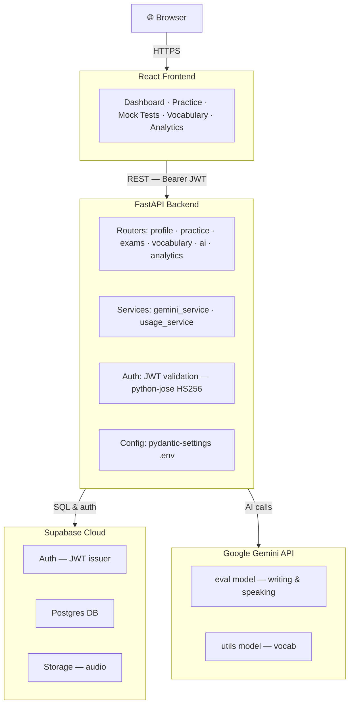

# Frensify

**Premium French learning and TEF/TCF exam preparation platform.**

Frensify is a tiered SaaS that helps students prepare for TEF and TCF exams through structured practice, AI-powered writing and speaking feedback, vocabulary building, mock tests, and analytics-driven progress tracking.

---

## Architecture



### Key Architectural Decisions


| Decision                           | Rationale                                                                                   |
| ---------------------------------- | ------------------------------------------------------------------------------------------- |
| FastAPI owns all business logic    | Keeps the React frontend thin and presentation-only                                       |
| Supabase JWT validated locally     | No round-trip to Supabase on every request; `python-jose` with HS256                        |
| Two Gemini API keys                | Separate billing/rate-limit pools for eval (writing/speaking) vs. utils (vocab) |
| `@lru_cache` Supabase client       | Single connection instance per worker process                                               |
| Weekly usage table                 | Enforces per-feature usage caps per tier without relying on Supabase RLS alone              |
| Signed URLs for audio              | Audio assets in Supabase Storage are never publicly exposed                                 |
| Audio deleted after Gemini success | Avoids orphaned audio blobs if the AI call fails                                            |


---

## Tech Stack


| Layer         | Technology                                           |
| ------------- | ---------------------------------------------------- |
| Frontend      | React (App Router)                                 |
| Backend API   | FastAPI 0.115+                                       |
| Auth          | Supabase Auth (JWT, HS256)                           |
| Database      | Supabase Postgres                                    |
| Audio Storage | Supabase Storage                                     |
| AI — Eval     | Google Gemini (writing + speaking feedback)          |
| AI — Utils    | Google Gemini (vocabulary explanations) |
| Config        | pydantic-settings                                    |
| Testing       | pytest + FastAPI TestClient                          |


---

## Demo

<video src="media_asset/Fresify_Demo.mp4" controls width="100%">
  Your browser does not support the video tag. <a href="media_asset/Fresify_Demo.mov">Download the demo video</a>.
</video>

---

## Repository Structure

```
Frensify/
├── frontend/                  # React frontend (App Router)
│   └── src/
├── backend/
│   ├── main.py                # FastAPI app, CORS, router registration
│   ├── config.py              # Settings (pydantic-settings), TIER_CAPS, MOCK_CAPS
│   ├── database.py            # Supabase client singleton (@lru_cache)
│   ├── dependencies.py        # JWT auth, get_profile, require_ai_cap factory
│   ├── requirements.txt
│   ├── routers/
│   │   ├── profile.py         # GET/PATCH /api/v1/profile
│   │   ├── practice.py        # GET /exercises, POST /exercises/{id}/complete
│   │   ├── exams.py           # Mock test CRUD + scoring
│   │   ├── vocabulary.py      # GET/PATCH /vocabulary
│   │   ├── ai.py              # Writing eval, speaking eval, vocab explain
│   │   └── analytics.py       # Score history, weak skills, streaks
│   ├── services/
│   │   ├── gemini_service.py  # All four Gemini call functions
│   │   └── usage_service.py   # get_or_create_week, increment, write_audit_log
│   └── tests/
│       ├── conftest.py        # app.dependency_overrides fixtures (mock_db, client)
│       ├── test_main.py
│       ├── test_dependencies.py
│       ├── test_profile.py
│       ├── test_practice.py
│       ├── test_exams.py
│       ├── test_vocabulary.py
│       ├── test_ai.py
│       ├── test_analytics.py
│       ├── test_gemini_service.py
│       └── test_usage_service.py
├── supabase/
│   └── migrations/            # SQL migrations
```

---

## API Endpoints

### Profile — `/api/v1/profile`


| Method | Path              | Description                               |
| ------ | ----------------- | ----------------------------------------- |
| GET    | `/api/v1/profile` | Fetch the authenticated user's profile    |
| PATCH  | `/api/v1/profile` | Update name, locale, or onboarding fields |


### Practice — `/api/v1/exercises`


| Method | Path                              | Description                                                   |
| ------ | --------------------------------- | ------------------------------------------------------------- |
| GET    | `/api/v1/exercises`               | List exercises (filter by `exam_type`, `skill`, `difficulty`) |
| POST   | `/api/v1/exercises/{id}/complete` | Mark an exercise complete and record the session              |


### Mock Tests — `/api/v1/exams`


| Method | Path                 | Description                        |
| ------ | -------------------- | ---------------------------------- |
| GET    | `/api/v1/exams`      | List available mock tests          |
| POST   | `/api/v1/exams`      | Start a new mock test attempt      |
| GET    | `/api/v1/exams/{id}` | Fetch a specific mock test attempt |
| PATCH  | `/api/v1/exams/{id}` | Submit answers and receive scores  |


### Vocabulary — `/api/v1/vocabulary`


| Method | Path                      | Description                                       |
| ------ | ------------------------- | ------------------------------------------------- |
| GET    | `/api/v1/vocabulary`      | List vocabulary cards (user's own + system cards) |
| PATCH  | `/api/v1/vocabulary/{id}` | Update mastery status or notes                    |


### AI — `/api/v1/ai`


| Method | Path                       | Tier Cap        | Description                                      |
| ------ | -------------------------- | --------------- | ------------------------------------------------ |
| POST   | `/api/v1/ai/writing-eval`  | Weekly per tier | Submit writing for AI correction and scoring     |
| POST   | `/api/v1/ai/speaking-eval` | Weekly per tier | Submit audio for fluency and structure feedback  |
| POST   | `/api/v1/ai/vocab-explain` | Weekly per tier | Get contextual explanation for a vocabulary word |
| POST   | `/api/v1/ai/mock-feedback` | —               | AI summary feedback on a completed mock test     |
| GET    | `/api/v1/ai/usage`         | —               | Current week's AI usage counts for the user      |


### Analytics — `/api/v1/analytics`


| Method | Path                            | Description                    |
| ------ | ------------------------------- | ------------------------------ |
| GET    | `/api/v1/analytics/scores`      | Score history over time        |
| GET    | `/api/v1/analytics/weak-skills` | Identified weak areas by skill |
| GET    | `/api/v1/analytics/streaks`     | Practice streak data           |


---

## Subscription Tiers


| Feature                       | Free | Pro | Max |
| ----------------------------- | ---- | --- | --- |
| Writing AI evals / week       | 0    | 2   | 4   |
| Speaking AI evals / week      | 0    | 2   | 4   |
| Vocab explanations / week     | 3    | 20  | 30  |
| Mock tests (lifetime)         | 0    | 2   | 4   |
| Basic vocabulary & exercises  | ✓    | ✓   | ✓   |
| Progress analytics            | —    | ✓   | ✓   |
| Unlimited practice            | —    | —   | ✓   |


Caps are enforced server-side in `dependencies.py` via the `weekly_usage` table. The `TIER_CAPS` and `MOCK_CAPS` dictionaries in `config.py` are the single source of truth.

---

## Authentication Flow

```
Browser
  │
  │  1. Sign in via Supabase Auth (email/password or OAuth)
  │     ← receives signed JWT (HS256, audience="authenticated")
  │
  │  2. All API requests include:  Authorization: Bearer <JWT>
  │
  ▼
FastAPI  dependencies.py → get_current_user()
  │
  │  3. Decode JWT locally with python-jose
  │     (SUPABASE_JWT_SECRET, algorithm=HS256, audience="authenticated")
  │
  │  4. Extract user_id (sub claim)
  │
  │  5. Look up profile row in Supabase Postgres
  │     → exposes tier, locale, onboarding state
  │
  └─► Route handler receives: profile dict with tier and user_id
```

Expired or malformed tokens return `401 Unauthorized` immediately — no database call is made.

---

## Speaking Evaluation Flow

```
Client
  │  POST /api/v1/ai/speaking-eval
  │  body: { audio_path: "storage/path/recording.webm", prompt: "..." }
  │
  ▼
FastAPI (routers/ai.py)
  │
  ├─ 1. Check weekly speaking_eval cap for user's tier  → 429 if exceeded
  ├─ 2. Download audio bytes from Supabase Storage (signed URL)
  ├─ 3. Call Gemini eval model with audio as base64 inline_data
  ├─ 4. Parse structured feedback (fluency, structure, score, suggestions)
  ├─ 5. Delete audio from Supabase Storage  ← only on success
  ├─ 6. Persist result to speaking_sessions table
  ├─ 7. Increment weekly usage counter
  └─ 8. Write audit log entry
  │
  ▼
Response: { score, fluency_notes, structure_notes, suggestions }
```

---

## Local Development

### Prerequisites

- Python 3.11+ (3.14 supported — see dependency notes below)
- A Supabase project (free tier works)
- Google Gemini API keys (two keys recommended — one for eval, one for utils)

### Setup

```bash
# 1. Clone and enter backend
git clone https://github.com/your-org/frensify.git
cd frensify/backend

# 2. Create virtual environment
python -m venv .venv
source .venv/bin/activate        # Windows: .venv\Scripts\activate

# 3. Install dependencies
pip install -r requirements.txt

# 4. Create .env (see Environment Variables section)
cp .env.example .env
# fill in your values

# 5. Run the server
uvicorn main:app --reload --port 8000
```

The API will be available at `http://localhost:8000`.  
Interactive docs: `http://localhost:8000/docs`

### Running Tests

```bash
cd backend
pytest tests/ -v
```

All 31 tests should pass. Tests use `app.dependency_overrides` to inject mock database and profile fixtures — no real Supabase or Gemini calls are made.

---

> **Never commit `.env` to version control.**

---

## Dependency Notes (Python 3.14)

Python 3.14 removed `asyncio.get_event_loop()` as an implicit default and dropped pre-built wheels for older native packages. Two constraints in `requirements.txt` address this:

- `supabase==2.9.0` — pinned exactly to avoid `storage3>=2.30.0` pulling in `pyiceberg`, which cannot build on Python 3.14.
- `pydantic>=2.10.0` — floats to 2.13+ which ships a Python 3.14 wheel for `pydantic-core` (no Rust/MSVC build needed).

---

## Test Coverage


| Test File                | What It Covers                                                         |
| ------------------------ | ---------------------------------------------------------------------- |
| `test_main.py`           | `/health` endpoint                                                     |
| `test_dependencies.py`   | JWT validation (valid, expired, malformed, wrong audience)             |
| `test_profile.py`        | GET and PATCH profile                                                  |
| `test_practice.py`       | Exercise listing, exercise completion                                  |
| `test_exams.py`          | Mock test CRUD, scoring, mock cap enforcement                          |
| `test_vocabulary.py`     | Vocabulary listing, mastery PATCH                                      |
| `test_ai.py`             | Writing eval, speaking eval, vocab explain, usage endpoint |
| `test_analytics.py`      | Score history, weak skills, streaks                                    |
| `test_gemini_service.py` | All four Gemini service functions (mocked SDK)                         |
| `test_usage_service.py`  | `get_or_create_week`, `increment`, `write_audit_log`                   |


---

## Product Tone

Frensify is designed to feel **calm, elegant, and exam-focused**. Every feature should lead the user toward a clear next action — whether that's reviewing a mistake, trying a harder prompt, or seeing their score improve over time.